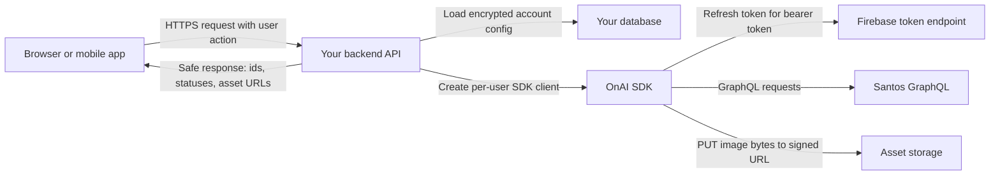
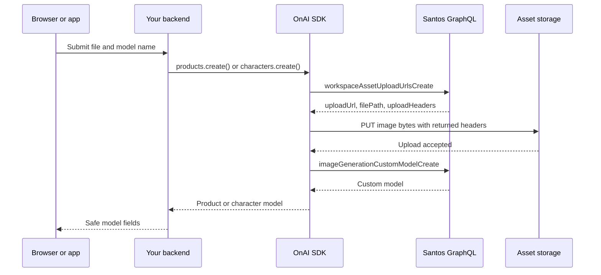
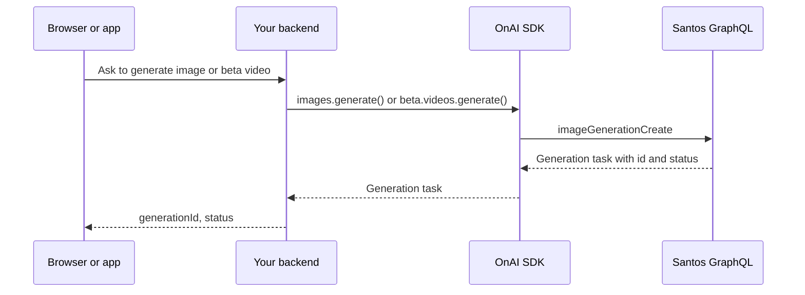
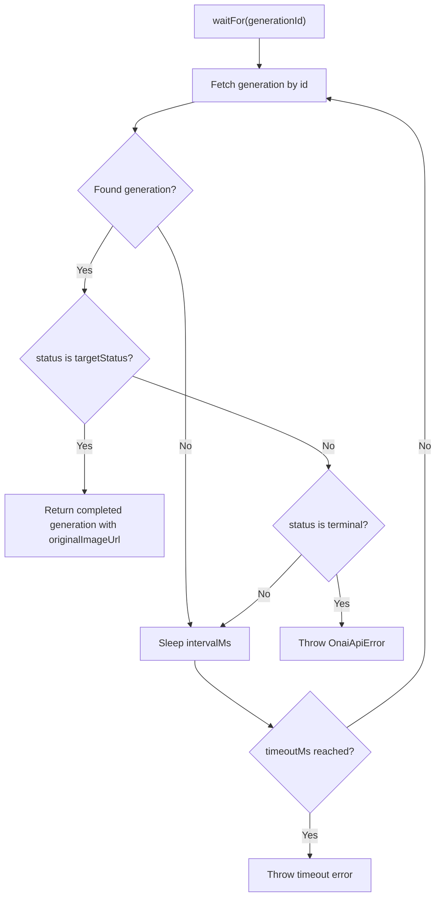
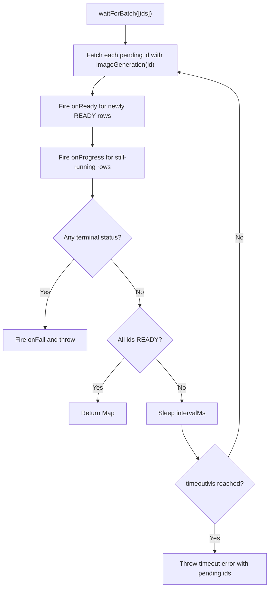
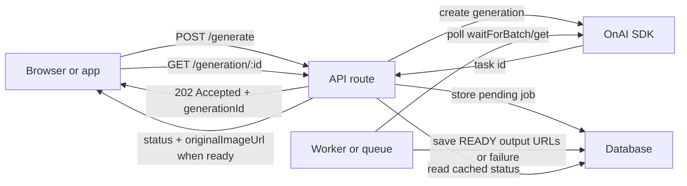
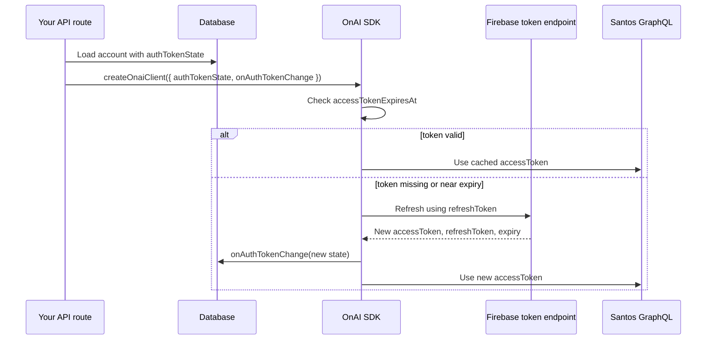

# OnAI SDK Documentation

Status: single source of truth
Owner: SDK maintainers
Audience: engineers, AI coding agents, integration partners, and future maintainers
Last reviewed: 2026-05-25

## Purpose

This document is the single long-lived reference for the OnAI server-side TypeScript SDK. It explains what the SDK promises, how to integrate it, how to use every public module, and what maintainers must preserve when the codebase changes.

Use this document when:

- Integrating the SDK into a product backend.
- Looking for copy-paste examples.
- Adding a new first-class SDK module.
- Debugging production integration issues.
- Handing the SDK to another engineer or AI assistant.
- Reviewing whether a change keeps the public contract stable.

Do not create a second SDK guide. Keep examples, public API notes, maintenance rules, beta policy, and AI handoff instructions in this file.

## Executive Summary

The SDK is a server-only TypeScript client for Santos image-generation workflows. It gives backend applications a typed interface for uploading source images, creating product and character AI models, listing/searching those models, generating images, checking cooldown status, and using beta video generation.

The SDK must never run in browser code because it handles refresh tokens. Every integration must load user-specific credentials on the server, create a client for that user or job, call the required SDK methods, and return only safe results to the browser.

## Install From GitHub

The current release path is GitHub. Install a pinned release tag in backend projects:

```bash
npm install github:mxhiraz/onai-sdk#v0.1.11
```

In `package.json`:

```json
{
  "dependencies": {
    "onai-sdk": "github:mxhiraz/onai-sdk#v0.1.11"
  }
}
```

You can also install from the HTTPS Git URL:

```bash
npm install git+https://github.com/mxhiraz/onai-sdk.git#v0.1.11
```

The package includes a `prepare` script, so GitHub installs build `dist` automatically before the SDK is packed for the consuming project.

For local SDK development:

```bash
npm install
npm run build
```

Use it from server-side code only. The SDK stores a refresh token and exchanges it for a Firebase bearer token before calling Santos.

## Local Sample Server

The repository includes a local sample server and HTML tester for manually exercising SDK modules.

Run it locally:

```bash
npm run sample:server
```

Open:

```text
http://localhost:4317
```

The page lets you paste credentials into the browser for the current local session. The browser sends them only to the local sample server, and the sample server creates the SDK client with:

```ts
createOnaiClient({
  refreshToken,
  firebaseApiKey,
  workspaceId,
});
```

The sample server does not pass custom SDK headers, tracking context, or arbitrary request headers. The SDK sends its built-in Santos-compatible headers.

Credentials used by the tester:

| Variable | Source |
|---|---|
| Firebase API key | Firebase `apiKey` from the signed-in account payload. |
| Refresh token | Firebase `stsTokenManager.refreshToken` from the signed-in account payload. |
| Workspace ID | Santos workspace ID used by the account. |

The sample page can test:

- `onai.images.cooldownStatus()`
- `onai.raw.graphqlRequest()`
- `onai.models.list()` for inspecting all models
- `onai.products.search()` and `onai.products.create()`
- `onai.characters.search()` and `onai.characters.create()`
- `onai.uploads.uploadImage()`, `onai.uploads.fromSignedUrl()`, and `onai.uploads.uploadToSignedUrl()`
- `onai.images.list()` and `onai.images.generate()`
- `onai.beta.videos.list()` and `onai.beta.videos.generate()`

When a request fails, the sample server logs a structured error to the terminal and returns the same debug payload to the page. The payload includes SDK error name, HTTP status, operation name, selected response headers such as `x-request-id` and rate-limit headers, GraphQL error messages, sanitized request variables, and a trimmed response-body preview.

The prompt builder can create Santos mention syntax from models selected in the sample UI:

```text
@[model name](model-id)
```

Never commit `.env`, refresh tokens, access tokens, signed upload URLs, or copied browser auth payloads.

## GitHub Release Flow

Only release from a clean, reviewed SDK folder. Bump the version before every new tagged release so downstream apps can pin a stable ref.

Preflight:

```bash
npm install
npm run build
```

Before pushing, scan the public surface:

```bash
rg -n 'SDK[_]OFFERINGS|onai[.]videos|GenerateVideoInput|\bVideosResource\b|from ".*[.]ts"|export .* from ".*[.]ts"' README.md src dist package.json tsconfig.json
```

Expected result: no matches. Also run the private provider-branding scan before release, but do not commit legacy provider names into public docs.

First GitHub push:

```bash
git init
git add .
git commit -m "Release onai-sdk"
git branch -M main
git remote add origin <github-repo-url>
git push -u origin main
```

Ongoing GitHub pushes:

```bash
git status --short
git add .
git commit -m "Release onai-sdk"
git push
```

Optional version tag:

```bash
git tag v0.1.11
git push origin v0.1.11
```

Downstream apps can install a branch, tag, or commit:

```bash
npm install github:mxhiraz/onai-sdk#main
npm install github:mxhiraz/onai-sdk#v0.1.11
npm install git+https://github.com/mxhiraz/onai-sdk.git#<commit-sha>
```

Never commit `.env`, refresh tokens, signed upload URLs, access tokens, generated cache folders, or private account data.

## Quick Start

```ts
import {
  ImageGenerationAspectRatio,
  ImageGenerationMode,
  ImageGenerationVersion,
  createOnaiClient,
} from "onai-sdk";

const onai = createOnaiClient({
  refreshToken: account.refreshToken,
  firebaseApiKey: account.firebaseApiKey,
  workspaceId: account.workspaceId,
});

const [character] = await onai.characters.search("tom");
const [product] = await onai.products.search("tss top");

if (!character || !product) {
  throw new Error("Required models were not found.");
}

const generation = await onai.images.generate({
  prompt: `${onai.images.mention(character)} WITH ${onai.images.mention(product)} `,
  aspectRatio: ImageGenerationAspectRatio.Portrait4x5,
  models: [
    onai.images.modelConfig(character),
    onai.images.modelConfig(product),
  ],
  mode: ImageGenerationMode.Max,
  samples: ImageGenerationVersion.Images1,
});

const completed = await onai.images.waitFor(generation.id);

console.log(completed.id);
console.log(completed.originalImageUrl);
```

## Public Contract

The stable public client is created with `createOnaiClient(config)`.

```ts
import { createOnaiClient } from "onai-sdk";

const onai = createOnaiClient({
  refreshToken: userConfig.refreshToken,
  firebaseApiKey: userConfig.firebaseApiKey,
  workspaceId: userConfig.workspaceId,
});
```

The stable modules are:

| Module | Stability | Responsibility |
|---|---:|---|
| `onai.auth` | Stable | Read or refresh persistable auth token state for backend caching. |
| `onai.uploads` | Stable | Create upload URLs, upload source-image bytes, and parse uploaded image references. |
| `onai.products` | Stable | Create, list, and search product models. |
| `onai.characters` | Stable | Create, list, and search character models. |
| `onai.models` | Stable | List products and characters together for inspection. |
| `onai.images` | Stable | Generate images, fetch generation history/status, wait for single or batched completion, and build prompt/model helper values. |
| `onai.generations` | Stable alias | Alias of `onai.images`. |
| `onai.raw` | Stable escape hatch | Call unsupported Santos GraphQL operations directly. |
| `onai.beta.videos` | Beta | Generate videos, fetch beta video generation status, and wait for completion. API may change before becoming stable. |

Do not expose beta video as a top-level stable video module until it is ready to become a stable contract.

## Module Flow Diagrams

The SDK is designed as a backend orchestration layer. The browser or mobile app should send user intent to your backend, and your backend should use the SDK to call Santos. This keeps credentials, upload URLs, and polling work off the user device.



Do not import the SDK in frontend code. The SDK may hold refresh tokens, signed upload URLs, bearer tokens, and workspace IDs during a request.

### Upload And Model Creation Flow

Use this flow for `onai.uploads.uploadImage()`, `onai.products.create()`, and `onai.characters.create()`.



`products.create()` and `characters.create()` can accept either an existing uploaded image reference or a direct upload payload. When direct bytes are passed, the SDK handles upload URL creation and file upload before creating the model.

### Generation Flow

Use this flow for `onai.images.generate()` and `onai.beta.videos.generate()`.



`generate()` starts work and returns quickly. It does not wait for output. Output URLs are usually empty until Santos marks the generation `READY`.

### Wait And Polling Flow

`waitFor(id)` polls Santos from the server process where the SDK is running. It does not run in the browser unless someone incorrectly imports the SDK into frontend code.

Use `bulkGenerateAndWait()` when a catalog shoot should be created and awaited in one SDK call. Use `bulkGenerate()` when you want to create the shoot, store the returned IDs, and let a background worker poll later. Use `waitForBatch(ids)` only for workflows that already have generation IDs.

Defaults:

| Option | Default | Meaning |
|---|---:|---|
| `intervalMs` | `3000` | Wait 3 seconds between status checks. |
| `timeoutMs` | `180000` | Stop waiting after 3 minutes. |
| `targetStatus` | `READY` | Return when the generation reaches this status. |
| `terminalStatuses` | `FAILED`, `ERROR`, `CANCELED`, `CANCELLED` | Throw if Santos returns one of these statuses. |



Batch wait flow:



Production recommendation:

- For small internal tools, it is acceptable to call `await onai.images.waitFor(id)` inside a backend route if the host allows long requests.
- For production web apps, return the generation ID immediately, store a job record, and poll from a backend worker or queue.
- For catalog shoots or other fan-out workflows, prefer `bulkGenerateAndWait()` when the backend worker should block until every generated row is ready. Use `bulkGenerate()` when you want to return/store pending IDs immediately.
- Let the browser poll your own lightweight status route, subscribe through SSE/WebSocket, or refresh from your database. Do not make the browser poll Santos directly.
- Use a 3-5 second backend polling interval for normal images. Use a longer interval for beta video when the expected duration is higher.
- Keep timeouts lower than your serverless function timeout. If your platform times out after 60 seconds, use a background worker instead of holding the HTTP request open.

### Recommended Production Architecture



This pattern minimizes device load and API load. The device makes cheap requests to your backend. The backend controls rate limits, timeouts, retries, and error handling. Santos credentials stay server-side.

## Module Behavior And Edge Cases

| Module | What It Does | Optimized Usage | Edge Cases |
|---|---|---|---|
| `onai.uploads` | Creates signed upload URLs, PUTs image bytes, returns `{ filePath, id }`. | Upload from the backend once, then reuse the returned image reference for create calls. | Upload URL may expire, `contentType` must match the file, storage PUT can fail, file bytes must not be empty. |
| `onai.products` | Creates, lists, and searches product models. Products use `modelType: "OBJECT"`. | Pass direct image bytes to `products.create()` for simple flows, or pass an uploaded image reference if you already uploaded. | At least one image is required; duplicate model names may still create new models; model warnings may be returned for low-resolution or unclear product images. |
| `onai.characters` | Creates, lists, and searches character models. Characters use `modelType: "CHARACTER"`. | Use one clear portrait/body reference when possible. Keep the returned model ID for prompt mentions. | Low-resolution faces may produce warnings; missing `imageOptions` can block generation config; character and product IDs must not be mixed in prompt config. |
| `onai.models` | Lists all product and character models together. | Use for admin/debug screens. Use typed `products.search()` or `characters.search()` for app workflows. | Santos does not accept server-side `search` for custom models right now, so search is SDK-side after listing. Cache repeated reads if your app calls it often. |
| `onai.images` | Generates images, bulk-generates catalog rows, reads history, polls status, checks cooldown, builds mentions and model configs. | Use `bulkGenerateAndWait()` for blocking catalog shoots, `bulkGenerate()` for fire-and-store shoots, `generate()` for one task, and `waitFor()` for one generation. | Cooldown may block usage; `originalImageUrl` is `null` until READY; rate limits can apply. `list({ ids, bulkGenerationId })` filters history SDK-side for dashboard-style reads. |
| `onai.generations` | Stable alias of `onai.images`. | Use only when the word "generation" is clearer in app code. | Same behavior and edge cases as `onai.images`. |
| `onai.beta.videos` | Beta video generation using the same generation task shape with `assetType: "VIDEO"`. | Keep behind feature flags and use worker polling. | Beta API may change; video waits may exceed normal HTTP timeouts; output may take longer than images. |
| `onai.raw` | Sends a custom Santos GraphQL operation. | Use only for backend-only workflows not wrapped by the SDK yet. | You own the query shape, variables, pagination, and schema drift risk. Never expose raw GraphQL from public frontend routes. |

## Load And Rate-Limit Guidelines

Use these defaults unless your production telemetry says otherwise.

| Workflow | Recommended Pattern | Why |
|---|---|---|
| Upload and create one model | Single backend request is fine. | It does one upload URL mutation, one storage PUT, and one model create mutation. |
| Generate without waiting | Return the task immediately. | Lowest latency and no long-held HTTP connection. |
| Generate and wait in a route | Only for internal tools or hosts with enough timeout. | Simple, but the HTTP connection stays open while backend polling happens. |
| Production wait | Queue or worker polls with `intervalMs` around `3000-5000`. | Keeps browser/device work low and avoids serverless timeout problems. |
| Batch production create | Use `bulkGenerate()` for catalog rows, then store the returned `bulkGenerationId` and generation IDs. | Creation is one backend mutation instead of N separate generate calls. |
| Blocking catalog shoot | Use `bulkGenerateAndWait()` with a concurrency limit. | The SDK creates all rows, extracts returned generation IDs internally, and polls direct `imageGeneration(id)` status calls. |
| Existing ID batch wait | Use `waitForBatch(ids)` with one worker per shoot/job. | Uses direct status calls for each ID with controlled concurrency. |
| Status updates to browser | Browser polls your backend every `3000-5000ms`, or use SSE/WebSocket. | The browser never touches Santos credentials or rate limits directly. |
| Lists/search screens | Cache model lists briefly per workspace. | Typed search is local after list; caching avoids repeated full-list calls. |
| Generation history | Use `listPage()` for infinite scroll. | Cursor pagination avoids pulling too much history. |

Avoid:

- Calling `waitFor()` from browser code.
- Running many `waitFor()` calls concurrently in one request.
- Starting one worker per generation when one `bulkGenerateAndWait()` or `waitForBatch()` call can watch the whole fan-out.
- Polling more often than every 2-3 seconds without a measured reason.
- Calling `models.list()` on every keypress. Debounce search and cache workspace model lists.
- Returning raw SDK error details to end users. Log debug details server-side and return friendly product errors.

## Configuration Model

The SDK supports both single-account and multi-account applications.

Single-account tools may use environment variables:

```ts
const onai = createOnaiClient({
  refreshToken: process.env.SANTOS_REFRESH_TOKEN!,
  firebaseApiKey: process.env.SANTOS_FIREBASE_API_KEY!,
  workspaceId: process.env.SANTOS_WORKSPACE_ID!,
});
```

Multi-user applications should load config from the database per connected account:

```ts
const account = await db.connectedAccounts.findByUserId(userId);

const onai = createOnaiClient({
  refreshToken: account.refreshToken,
  firebaseApiKey: account.firebaseApiKey,
  workspaceId: account.workspaceId,
});
```

Recommended storage fields:

| Field | Required | Notes |
|---|---:|---|
| `userId` | Yes | Your application's owner for the connected Santos account. |
| `refreshToken` | Yes | Store encrypted at rest. Never return to browser code. |
| `firebaseApiKey` | Yes | Required for token refresh. Store server-side. |
| `workspaceId` | Yes | Default workspace for SDK calls. |
| `accessToken` | Optional | Cache the current bearer token to avoid refreshing on every SDK client creation. Store encrypted at rest. |
| `accessTokenExpiresAt` | Optional | Epoch milliseconds for `accessToken` expiry. Required when storing `accessToken`. |
| `createdAt` | Yes | Useful for account lifecycle and audits. |
| `updatedAt` | Yes | Useful when credentials rotate. |
| `revokedAt` | Optional | Mark disconnected accounts without deleting audit history. |

Create the SDK client inside the request handler or background job after loading the account. Avoid a global singleton when each user has different credentials.

## Auth Token Cache

The SDK client is cheap to create per request. The expensive part is refreshing a Firebase token every time a new SDK client is created with only a refresh token. To avoid that latency, persist the SDK auth token state in your database and pass it back into the next SDK client.

Recommended request flow:



Example:

```ts
const account = await db.connectedAccounts.findByUserId(userId);

const onai = createOnaiClient({
  firebaseApiKey: account.firebaseApiKey,
  workspaceId: account.workspaceId,
  authTokenState: {
    accessToken: account.accessToken,
    accessTokenExpiresAt: account.accessTokenExpiresAt,
    refreshToken: account.refreshToken,
  },
  onAuthTokenChange: async (state) => {
    await db.connectedAccounts.update(userId, {
      accessToken: state.accessToken,
      accessTokenExpiresAt: state.accessTokenExpiresAt,
      refreshToken: state.refreshToken,
    });
  },
});

const cooldown = await onai.images.cooldownStatus();
```

Standalone auth module:

```ts
const state = await onai.auth.getTokenState();

await db.connectedAccounts.update(userId, {
  accessToken: state.accessToken,
  accessTokenExpiresAt: state.accessTokenExpiresAt,
  refreshToken: state.refreshToken,
});
```

Use `onai.auth.refreshTokenState()` when you intentionally want to force a refresh, for example during account connection or credential repair.

Auth cache rules:

- `authTokenState.accessToken` is used only when `accessTokenExpiresAt` is still outside the refresh window.
- The SDK refreshes automatically when the token is missing, expired, or close to expiry.
- The default refresh window is 60 seconds. Override it with `authRefreshSkewMs` only when you understand your job duration and clock drift.
- If a refresh response includes a new refresh token, the SDK includes it in `onAuthTokenChange`.
- Always store auth token state server-side and encrypted at rest.
- If `onAuthTokenChange` fails, the SDK logs a warning and continues the current request. To guarantee persistence, call `onai.auth.getTokenState()` after the SDK task and save the returned state.

## Logging

The SDK supports structured logging for backend observability. Logging is disabled by default. Enable it only on the server.

Use the built-in Pino logger:

```ts
const onai = createOnaiClient({
  refreshToken: account.refreshToken,
  firebaseApiKey: account.firebaseApiKey,
  workspaceId: account.workspaceId,
  logger: true,
  logLevel: "debug",
});
```

Or pass an existing Fastify/Pino-style logger:

```ts
const onai = createOnaiClient({
  refreshToken: account.refreshToken,
  firebaseApiKey: account.firebaseApiKey,
  workspaceId: account.workspaceId,
  logger: fastify.log.child({ sdk: "onai" }),
});
```

Supported levels:

```ts
type OnaiLogLevel = "trace" | "debug" | "info" | "warn" | "error" | "silent";
```

What gets logged:

| Area | Events |
|---|---|
| Auth | Token refresh start, cache hit, refresh success, refresh failure. |
| GraphQL | Operation start, sanitized variables at `trace`, success, HTTP errors, GraphQL errors, request ID, rate-limit remaining, duration. |
| Uploads | Upload URL creation, storage PUT start/success/failure. |
| Models | Product/character custom-model create and list operations. |
| Images | Cooldown checks, generation create, generation history pagination, wait/poll lifecycle. |
| Beta videos | Same generation lifecycle as images, under the beta video component. |

Log safety rules:

- The SDK never logs bearer tokens, refresh tokens, Firebase API keys, request bodies, signed URLs, upload URLs, or authorization headers.
- Custom logger methods should be Pino-compatible: `logger.info(object, message)`, `logger.warn(object, message)`, and so on.
- SDK logging is best for backend debugging and telemetry. Do not expose structured debug logs directly to end users.
- `trace` is intentionally noisy because it includes poll iterations and sanitized request variables. Use `debug` for normal development and `info` or `warn` in production.
- Logging must never break SDK calls. If a user-provided logger throws, the SDK ignores that logger failure and continues the original SDK operation.

## Request Headers and User Context

The SDK automatically sends Santos-compatible browser-style headers. You do not need to pass a full header block for normal usage.

By default the SDK sends:

- Browser user agent.
- Browser client hint headers: `Sec-GPC`, `sec-ch-ua-platform`, `sec-ch-ua`, and `sec-ch-ua-mobile`.
- `Referer`.
- `apollo-require-preflight`.
- Santos consent integrations.
- Santos tracking context with `platform: "web"`, the configured workspace ID, `g_workspace_id`, the captured web route as `url`, and `fbp`.

Header rules:

- The public SDK config does not accept custom request headers.
- The SDK controls browser-style headers, auth, content type, referer, tracking, and consent headers.
- Santos tracking context is generated by the SDK and is not user-overridable.
- Do not add app-specific tracking, test URLs, custom session IDs, or arbitrary request headers through the SDK.
- Response headers such as `access-control-allow-origin`, `etag`, `server`, `x-ratelimit-limit`, `x-ratelimit-remaining`, and content security policy headers are returned by Santos. They are not request headers and must not be sent by the SDK.

## Runtime URLs

Santos runtime URLs are built into the SDK and exposed as `SANTOS_RUNTIME_URLS` for advanced use.

```ts
import { SANTOS_RUNTIME_URLS, createOnaiClient } from "onai-sdk";

const onai = createOnaiClient({
  refreshToken: account.refreshToken,
  firebaseApiKey: account.firebaseApiKey,
  workspaceId: account.workspaceId,
  urls: SANTOS_RUNTIME_URLS,
});
```

Most integrations should not pass `urls`; defaults are already applied. Override runtime URLs only for staging, a server-side proxy, or controlled tests.

## Core Workflows

These examples are the canonical integration path. Keep them current whenever the SDK surface changes.

### Upload Source Image

Use `uploadImage()` when the backend has image bytes. The SDK asks Santos for a signed upload URL, uploads the bytes with the required upload headers, and returns the image reference that product and character creation need.

```ts
const uploadedImage = await onai.uploads.uploadImage({
  fileName: "tss-top.jpg",
  contentType: "image/jpeg",
  body: imageBytes,
});

console.log(uploadedImage.filePath);
console.log(uploadedImage.id);
```

Product and character creation can also upload directly in one call:

```ts
const product = await onai.products.create({
  name: "tss top",
  image: {
    fileName: "tss-top.jpg",
    contentType: "image/jpeg",
    body: imageBytes,
  },
});

const character = await onai.characters.create({
  name: "tom",
  image: {
    fileName: "tom.jpg",
    contentType: "image/jpeg",
    body: characterImageBytes,
  },
});
```

Use `uploadToSignedUrl()` only when a backend already has its own signed upload URL.

```ts
const uploadedImage = await onai.uploads.uploadToSignedUrl({
  signedUrl,
  contentType: "image/jpeg",
  body: imageBytes,
});

console.log(uploadedImage.filePath);
console.log(uploadedImage.id);
```

Use `fromSignedUrl()` only when the file has already been uploaded and the integration needs to reconstruct the SDK image reference.

```ts
const uploadedImage = onai.uploads.fromSignedUrl(signedUrl);
```

The returned object includes `filePath` and `id`, which can be passed to product or character creation.

### Create Product Model

```ts
const product = await onai.products.create({
  name: "tss top",
  image: uploadedImage,
  skipTraining: true,
});

console.log(product.id);
console.log(product.status);
```

Products map to Santos custom models with `modelType: "OBJECT"`.

`image` can be either an uploaded image reference from `onai.uploads.uploadImage()` or a direct upload payload with `fileName`, `contentType`, and `body`.

### Create Character Model

```ts
const character = await onai.characters.create({
  name: "tom",
  image: uploadedImage,
  skipTraining: true,
});

console.log(character.id);
console.log(character.status);
```

Characters map to Santos custom models with `modelType: "CHARACTER"`.

`image` can be either an uploaded image reference from `onai.uploads.uploadImage()` or a direct upload payload with `fileName`, `contentType`, and `body`.

### List Models And Search Typed Models

```ts
const allModels = await onai.models.list();
const products = await onai.products.search("shirt");
const characters = await onai.characters.search("tom");
```

Use `onai.models.list()` only when you need to inspect everything in the workspace. Search belongs to the typed workflows: use `onai.products.search()` for product models and `onai.characters.search()` for character models. The Santos custom-model list operation currently rejects a `search` input, so typed search lists workspace models first and narrows the returned set by model text.

### Generate Image

```ts
const generation = await onai.images.generate({
  prompt: `${onai.images.mention(character)} WITH ${onai.images.mention(product)} `,
  aspectRatio: ImageGenerationAspectRatio.Portrait4x5,
  models: [
    onai.images.modelConfig(character),
    onai.images.modelConfig(product),
  ],
  mode: ImageGenerationMode.Max,
  samples: ImageGenerationVersion.Images1,
});

const completed = await onai.images.waitFor(generation.id, {
  intervalMs: 3_000,
  timeoutMs: 180_000,
});

console.log(completed.id);
console.log(completed.status);
console.log(completed.originalImageUrl);
console.log(completed.originalImageUrls);
```

`generate()` returns the generation task. `waitFor(id)` polls Santos `imageGeneration(id)` until the generation is `READY`, then returns the completed generation. `originalImageUrl` is the first completed output's original URL. It is `null` until Santos returns generated output. `originalImageUrls` contains every generated output URL, so use it when `samples` is `Images2` or `Images4`.

You can also inspect generation history directly:

```ts
const recentImages = await onai.images.list({ limit: 10 });
const selectedImages = await onai.images.list({ ids: ["generation-a", "generation-b"], limit: 50, maxPages: 1 });
const generationById = await onai.images.get(generation.id);
```

Santos generation history requires `first` and does not accept a `search` input on `imageGenerations`. The SDK sends `first` from `pageSize` when provided, otherwise from `limit`, follows `pageInfo.nextCursor` until it reaches `limit`, runs out of pages, or hits `maxPages` (default `50`). Use `listPage({ cursor, limit, pageSize })` when you want to control pagination manually.

`get(id)` and `waitFor(id)` use Santos `imageGeneration(id)` directly, so single-generation status checks do not scan history pages.

`ids` and `bulkGenerationId` are SDK-side filters for now. They keep your app code clean, but the SDK still pulls recent history pages and filters locally until Santos supports server-side id arrays.

Prompt mentions and model configs must stay aligned. If the prompt references a model, include that model in `models` unless a lower-level raw operation intentionally does otherwise.

### Batch Wait For Multiple Generations

Use `waitForBatch()` when a workflow already has generation IDs. For new catalog-shoot code, prefer `bulkGenerateAndWait()` below so the SDK creates the shoot and polls the returned IDs internally.

```ts
const completed = await onai.images.waitForBatch(generationIds, {
  intervalMs: 3_000,
  timeoutMs: 180_000,
  concurrency: 5,
  onProgress: async (id, generation) => {
    await db.generations.update(id, { status: generation.status });
  },
  onReady: async (id, generation) => {
    await db.generations.update(id, {
      status: generation.status,
      originalImageUrl: generation.originalImageUrl,
    });
  },
  onFail: async (id, reason) => {
    await db.generations.update(id, { status: "FAILED", reason });
  },
});

for (const [id, generation] of completed) {
  console.log(id, generation.originalImageUrl);
}
```

Batch wait behavior:

- One poll loop watches all ids.
- Each poll fetches pending IDs with direct Santos `imageGeneration(id)` status requests.
- Default `concurrency` is `Math.min(ids.length, 5)`.
- Increase `concurrency` when your backend can tolerate more simultaneous status requests.
- Decrease `concurrency` when you want stricter API-load limits.
- `onReady` fires once per id when it first reaches `READY`.
- `onProgress` fires for found, non-terminal, non-ready generations.
- `onFail` fires before the SDK throws when any watched generation reaches a terminal status.
- The returned `Map` is ordered by the input ids.

`onai.beta.videos.waitForBatch()` has the same behavior for beta video generation tasks.

### Bulk Generate Catalog Shoots

Use `bulkGenerateAndWait()` as the preferred blocking production path when your app creates a whole shoot or job at once.

```ts
const bulkGenerationId = crypto.randomUUID();

const shoot = await onai.images.bulkGenerateAndWait(
  {
    prompt: "commercial catalog photo",
    aspectRatio: ImageGenerationAspectRatio.Portrait4x5,
    bulkGenerationId,
    rows: [
      {
        productModelIds: ["product-top"],
        characterModelIds: ["character-model"],
      },
      {
        productModelIds: ["product-shoes"],
        characterModelIds: ["character-model"],
      },
    ],
  },
  {
    intervalMs: 3_000,
    timeoutMs: 180_000,
    concurrency: 5,
    onReady: async (id, generation) => {
      await db.generations.update(id, {
        status: generation.status,
        originalImageUrl: generation.originalImageUrl,
      });
    },
    onFail: async (id, reason) => {
      await db.generations.update(id, { status: "FAILED", reason });
    },
  },
);

await db.shoots.insert({
  id: shoot.bulkGenerationId,
  status: "READY",
  generationIds: shoot.imageGenerations.map((generation) => generation.id),
  originalImageUrls: shoot.imageGenerations.flatMap((generation) => generation.originalImageUrls ?? []),
});
```

Bulk generate behavior:

- `bulkGenerate()` calls Santos `imageGenerationBulkCreate`.
- `bulkGenerateAndWait()` calls `bulkGenerate()`, extracts the returned `imageGenerations[].id`, and polls each ID through direct `imageGeneration(id)` status requests.
- The SDK generates a `bulkGenerationId` automatically when you do not pass one.
- Each row can include `productModelIds`, `characterModelIds`, or both.
- The SDK sends the bulk `prompt` exactly as provided. It does not append product or character mentions; row model IDs are sent separately in `rows`.
- The response includes `bulkGenerationId` and `imageGenerations`.
- Use `bulkGenerate()` without waiting when you want to store pending generation IDs and let a separate worker call `waitForBatch(ids)` later.

Beta video does not expose bulk creation yet.

### Generate Video Beta

Video generation is beta-only.

```ts
const video = await onai.beta.videos.generate({
  prompt: `${onai.beta.videos.mention(character)} with ${onai.beta.videos.mention(product)} `,
  aspectRatio: VideoGenerationAspectRatio.Landscape16x9,
  models: [
    onai.beta.videos.modelConfig(character),
    onai.beta.videos.modelConfig(product),
  ],
  duration: VideoGenerationDuration.Seconds5,
  sound: VideoGenerationSound.Off,
  videoOptions: {
    cameraMotion: VideoGenerationCameraMotion.Auto,
  },
});

const completedVideo = await onai.beta.videos.waitFor(video.id);

console.log(completedVideo.id);
console.log(completedVideo.status);
console.log(completedVideo.originalImageUrl);
```

Keep video integrations behind product flags or internal controls until the API graduates from beta.

### Check Cooldown

```ts
const cooldown = await onai.images.cooldownStatus();

if (!cooldown.isEligible) {
  throw new Error(`Generation cooldown ends at ${cooldown.cooldownEndsAt}`);
}
```

Cooldown status is a helper for product UX. The SDK does not automatically block generation based on cooldown.

## Supported Options

Stable image modes:

```ts
ImageGenerationMode.Default; // "default"
ImageGenerationMode.Max; // "max"
ImageGenerationMode.Premium; // "premium"
```

Stable image ratios:

```ts
ImageGenerationAspectRatio.Portrait9x16; // "9:16"
ImageGenerationAspectRatio.Portrait2x3; // "2:3"
ImageGenerationAspectRatio.Portrait3x4; // "3:4"
ImageGenerationAspectRatio.Portrait4x5; // "4:5"
ImageGenerationAspectRatio.Square; // "1:1"
ImageGenerationAspectRatio.Landscape5x4; // "5:4"
ImageGenerationAspectRatio.Landscape4x3; // "4:3"
ImageGenerationAspectRatio.Landscape3x2; // "3:2"
ImageGenerationAspectRatio.Landscape16x9; // "16:9"
ImageGenerationAspectRatio.Ultrawide21x9; // "21:9"
```

Stable image versions:

```ts
ImageGenerationVersion.Images1; // 1 image
ImageGenerationVersion.Images2; // 2 images
ImageGenerationVersion.Images4; // 4 images
```

Beta video ratios:

```ts
VideoGenerationAspectRatio.Landscape16x9; // "16:9"
VideoGenerationAspectRatio.Square; // "1:1"
VideoGenerationAspectRatio.Portrait9x16; // "9:16"
```

Beta video durations:

```ts
VideoGenerationDuration.Seconds4; // 4s
VideoGenerationDuration.Seconds5; // 5s
VideoGenerationDuration.Seconds6; // 6s
VideoGenerationDuration.Seconds7; // 7s
VideoGenerationDuration.Seconds8; // 8s
VideoGenerationDuration.Seconds9; // 9s
VideoGenerationDuration.Seconds10; // 10s
VideoGenerationDuration.Seconds11; // 11s
VideoGenerationDuration.Seconds12; // 12s
VideoGenerationDuration.Seconds13; // 13s
VideoGenerationDuration.Seconds14; // 14s
VideoGenerationDuration.Seconds15; // 15s
```

Beta video sound:

```ts
VideoGenerationSound.Off; // withAudio false
VideoGenerationSound.On; // withAudio true
```

Beta video camera motion:

```ts
VideoGenerationCameraMotion.Auto; // "AUTO"
```

## Security Rules

The SDK is server-side only. Preserve these rules:

- Never import this SDK in frontend bundles.
- Never expose refresh tokens, access tokens, Firebase API keys, signed upload URLs, or workspace credentials to browser logs.
- The SDK sends Santos-compatible browser-style headers automatically and does not expose public custom header overrides.
- Store refresh tokens encrypted at rest.
- Store persisted `authTokenState` encrypted at rest.
- Create SDK clients per tenant when accounts differ.
- Return generated asset URLs and safe status fields to the browser, not raw API payloads.
- Keep user-facing errors branded as Santos and avoid exposing raw upstream response bodies.
- Treat `raw.graphqlRequest()` as privileged backend functionality.
- Keep SDK logs server-side. Logs are sanitized, but they are still operational telemetry and should not be shown directly to users.

## Error Policy

The SDK intentionally trims and sanitizes low-level response payloads from thrown errors. Public errors should be useful but not leak private tokens, bearer tokens, refresh tokens, signed upload URLs, or full raw upstream messages.

Expected error classes:

| Error | Use |
|---|---|
| `OnaiValidationError` | Invalid SDK input or browser runtime usage. |
| `OnaiAuthError` | Token refresh failure or malformed auth response. |
| `OnaiApiError` | Santos GraphQL or upload request failure. |
| `OnaiSdkError` | Base class for SDK-specific errors. |

When adding new errors, include a human-readable message, optional HTTP status, and a compact `details.reason` string. GraphQL request failures should include operation name, status, selected response headers, GraphQL messages, sanitized variables, and a short response preview. Do not attach full raw responses or secrets.

## Beta Policy

Beta APIs must live under `onai.beta`.

Current beta APIs:

- `onai.beta.videos.generate()`
- `onai.beta.videos.create()`
- `onai.beta.videos.list()`
- `onai.beta.videos.get()`
- `onai.beta.videos.waitFor()`
- `onai.beta.videos.waitForBatch()`
- `onai.beta.videos.modelConfig()`
- `onai.beta.videos.mention()`

Before promoting a beta API to stable:

- Confirm the request shape has stopped changing.
- Confirm naming is consistent with stable modules.
- Add or update examples in this document.
- Keep a migration note for users already on the beta namespace.
- Run the build and public-surface scans listed below.

## Raw GraphQL Policy

`onai.raw.graphqlRequest()` exists so maintainers can move quickly when Santos exposes a workflow before the SDK has a typed wrapper. Use it sparingly.

Add a first-class module when:

- The operation is used by more than one integration.
- The variables are stable enough to type.
- The response is needed by product code.
- The workflow appears in user-facing documentation.

## Maintenance Checklist

Run this checklist whenever the SDK changes:

- Update this document when a workflow, public module, config rule, beta status, security rule, error policy, or example changes.
- Document generated output convenience fields such as `originalImageUrl` when they change.
- Keep this as the only full SDK guide.
- Keep examples server-side.
- Keep video under `onai.beta.videos` until promotion is intentional.
- Keep imports NodeNext-compatible with `.js` endings in source.
- Keep package exports pointed at `dist`.
- Keep `docs` included in `package.json` files.
- Keep automatic request header behavior documented when config changes.
- Keep auth token cache behavior documented when auth state fields, refresh timing, or callback behavior changes.
- Keep logging behavior documented when logger events, log levels, or redaction rules change.
- Do not pass `search` into Santos custom-model or generation-history GraphQL list operations unless the schema starts accepting it.
- Run `npm run build`.
- Scan for accidental non-Santos branding, `.ts` import endings, and stale stable video references.

Recommended scan categories:

- Stale stable video namespace or old non-beta video type names.
- NodeNext source imports that end in `.ts`.
- Non-Santos public branding.

Expected result: no matches.

## AI Handoff Prompt

Use this prompt when asking an AI coding assistant to integrate or update the SDK:

```text
You are integrating the OnAI server-side TypeScript SDK. Keep the SDK server-only. Load refreshToken, firebaseApiKey, and workspaceId from server-side configuration or the app database for each connected account. Do not expose credentials to browser code.

Use onai.auth for persisted auth token state, onai.uploads for source-image uploads, onai.products for product models, onai.characters for character models, onai.models only for listing all models, onai.images for stable image generation, and onai.beta.videos only for beta video generation. Load authTokenState from the database when creating the SDK client and save onAuthTokenChange back to the database so the SDK does not refresh auth on every request. Product and character creation can accept either an uploaded image reference or a direct upload payload with fileName, contentType, and body. For backend observability, pass logger: true or a Fastify/Pino-style logger and choose logLevel. After creating a single generation, call waitFor(id) to fetch the READY generation and read originalImageUrl/originalImageUrls. For blocking catalog fan-out jobs, call bulkGenerateAndWait() so the SDK creates rows in one Santos mutation, extracts returned generation IDs, and polls direct imageGeneration(id) status calls with controlled concurrency. For fire-and-store jobs, call bulkGenerate(), store returned generation IDs, and let one backend worker call waitForBatch(ids). Keep video behind beta controls. Use exported enums instead of raw strings where possible.

Preserve Santos branding in public docs and user-facing errors. Do not expose raw upstream errors. After changes, run npm run build and scan for stale stable video references, non-Santos branding, and .ts import endings.
```

## Glossary

| Term | Meaning |
|---|---|
| Product model | A Santos custom model with `modelType: "OBJECT"`. |
| Character model | A Santos custom model with `modelType: "CHARACTER"`. |
| Source image | Uploaded image used to create a custom model. |
| Prompt mention | `@[name](id)` reference inserted into prompts. |
| Model config | `id`, `imageUrl`, and `modelType` passed to generation. |
| Stable API | Public SDK surface expected to avoid breaking changes. |
| Beta API | Public SDK surface allowed to change before promotion. |
